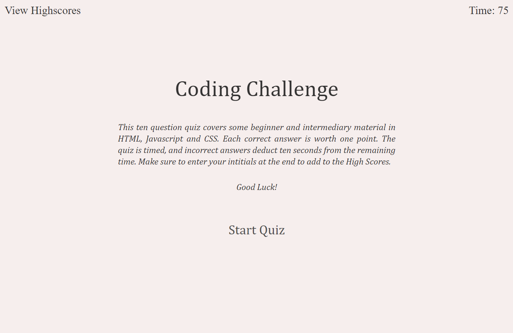
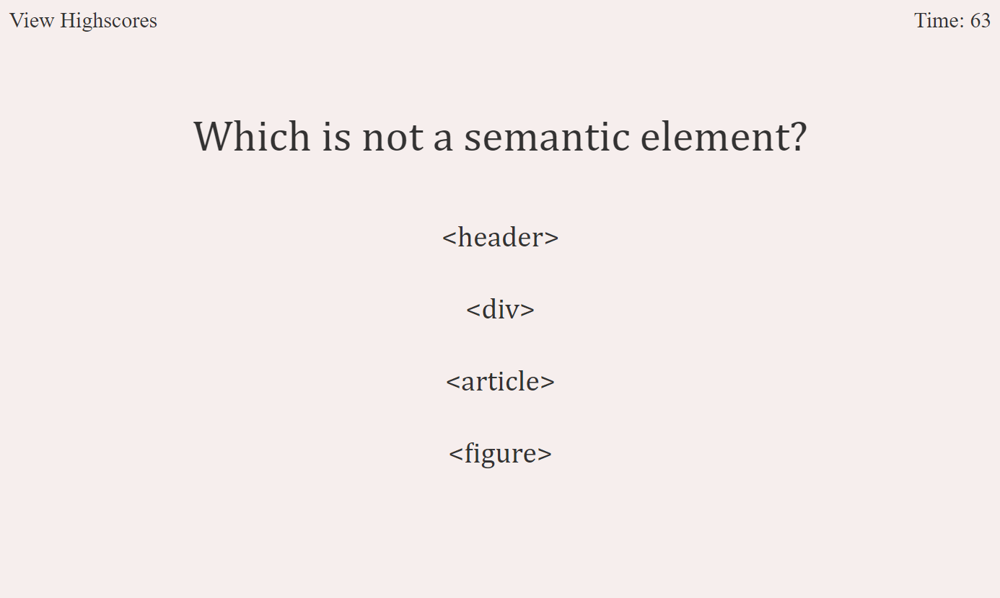
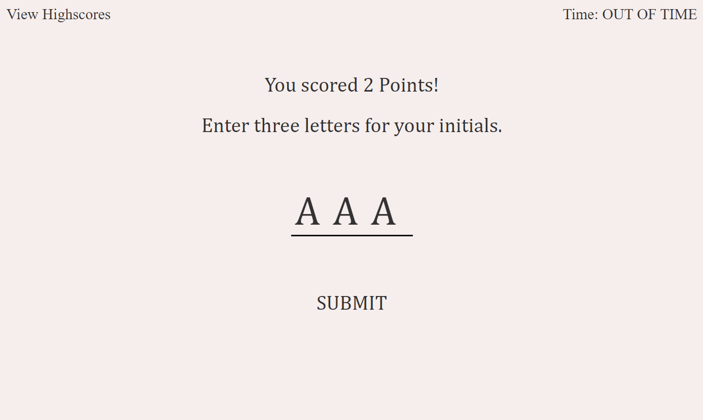
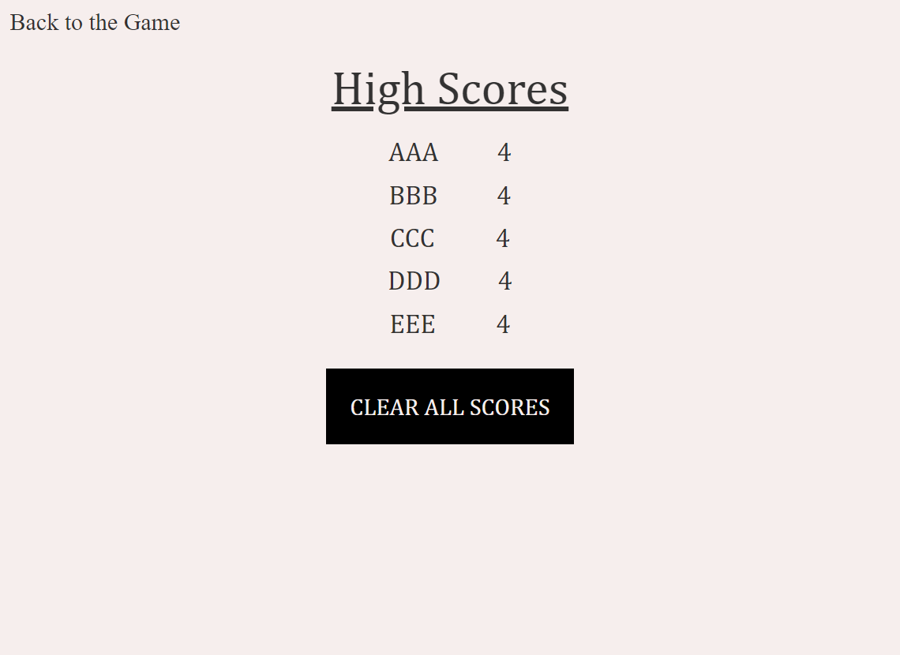

# CodingQuiz

## Summary

This web app is a ten question quiz to test for proficiency in front-end web development.

## Details

- Starts at landing page with app description and start quiz button.
- On clicking the start quiz button, timer starts counting down and user is shown a question with four options.
- When a question is answered, user is shown if they answered correctly or incorrectly.
- When question is answered incorrectly, time is subtracted from the clock
- When all questions are answered or the time runs out, the user is shown the results and prompted to enter their initials for the high score board.
- Initials and points are saved.
- Top ten scores can be seen by navigating to the high scores page.
- High scores can be cleared

## Screenshots

## Live Site

https://joechristianson.github.io/CodingQuiz/